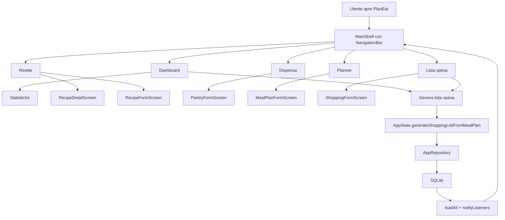

# Diagramma flusso


```mermaid
flowchart TD
    A["Utente apre PlanEat"] --> B["MainShell con NavigationBar"]
    B --> C["Dashboard"]
    B --> D["Ricette"]
    B --> E["Dispensa"]
    B --> F["Planner"]
    B --> G["Lista spesa"]
    C --> H["Statistiche"]
    D --> I["RecipeDetailScreen"]
    D --> J["RecipeFormScreen"]
    E --> K["PantryFormScreen"]
    F --> L["MealPlanFormScreen"]
    G --> M["ShoppingFormScreen"]
    C --> N["Genera lista spesa"]
    G --> N
    N --> O["AppState.generateShoppingListFromMealPlan"]
    O --> P["AppRepository"]
    P --> Q["SQLite"]
    Q --> R["loadAll + notifyListeners"]
    R --> B
```

## Flusso dati

```text
UI -> AppState -> AppRepository -> AppDatabase -> SQLite
SQLite -> AppRepository -> AppState -> notifyListeners -> UI
```
